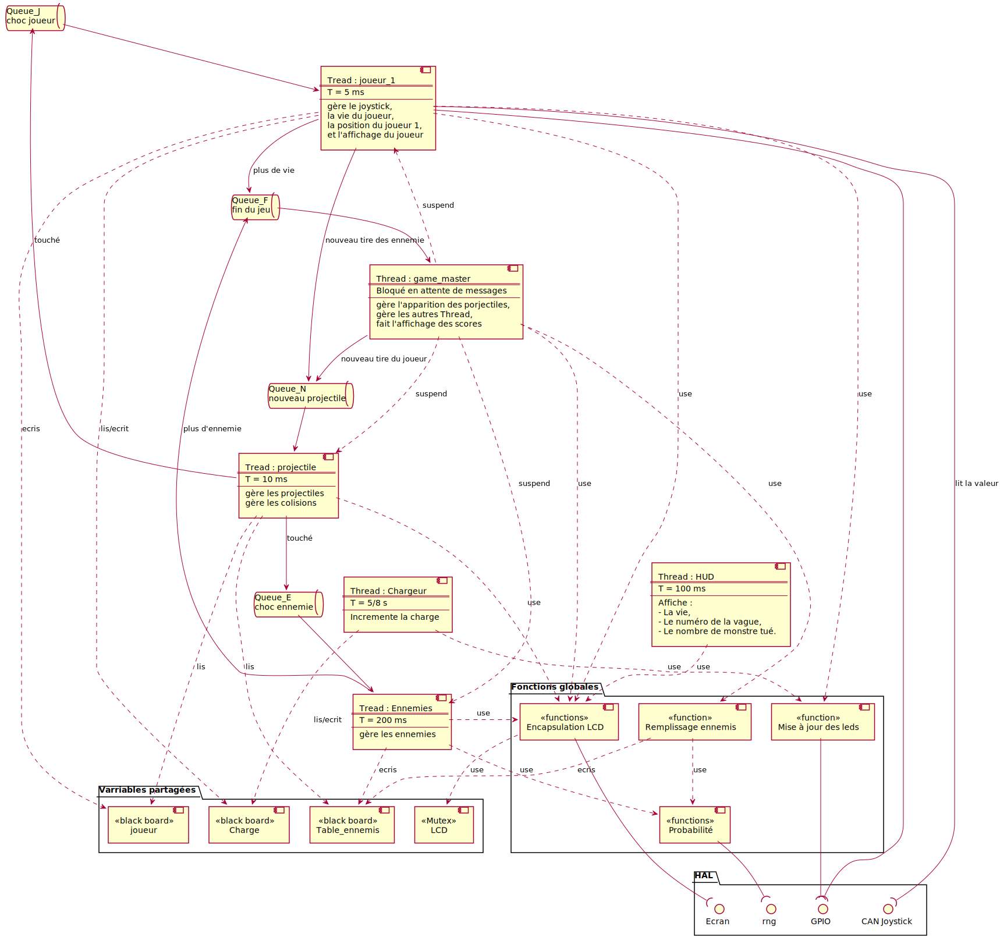

# Architecture du programme

Le programe comporte plusieurs composants. Il y a :

- des [threads](thread.md)

    - des queues, pour comuniquer entre les threads,

    - des variables partagées (type black board),

    - un mutex, pour gérer l'accès à l'écran

- des [classes](class.md)

- des périphériques :

    - L'[écran](lcd.md)

    - Le [générateur de nombre aléatoire](rng.md)

    - Les [leds](led.md)

    - Le [joystick](joystick.md)

## Diagramme des composants :

Les composants interagissent de la manière suivante :


## Principales variables :

Les principales variables sont :

- ```joueur``` qui représente l'entier joueur et contient toutes les informations nécéssaires,
- ```Table_ennemis``` qui contient tous les monstres ainsi que leurs informations.

