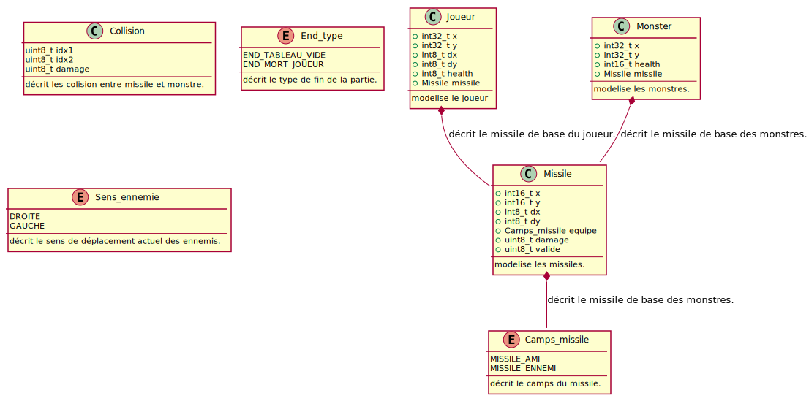

# Classes

Les classes utilisées sont les suivantes :



## Classe de représentation

Pour représenter les éléments dans le jeu, on utilise les classes :

- ```Joueur``` qui n'est instanciée qu'une seule fois, et qui représente le joueur,

- ```Monster``` qui représente les monstres,

- ```Missile``` qui représente les projectiles.

Des instances de la classe ```Missile``` sont membres des deux autres classes car elles représentent les projectiles de base.

De plus, les threads ```Joueur_1``` et ```Block_Enemie``` envoient des objets ```Missile``` dans la ```queue_N``` vers le thread ```Projectile``` pour lui signaler les nouveaux missiles à simuler.

## Classe de messagerie

Les classes utiles pour les messages sont ```struct Collision``` qui permet de transmettre toutes les informations relatives à un choc avec un monstre en même temps, et la classe ```enum End_Type``` qui décrit le type de fin de vague que l'on rencontre (défaite des monstres ou du joueur).